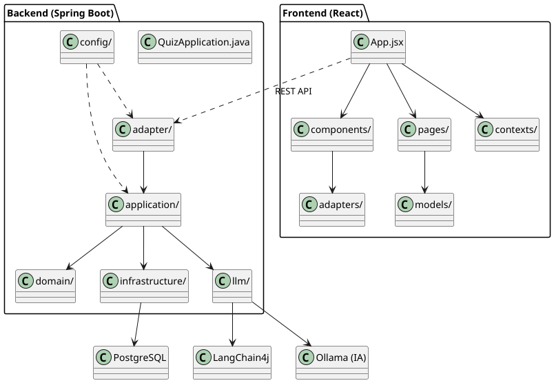
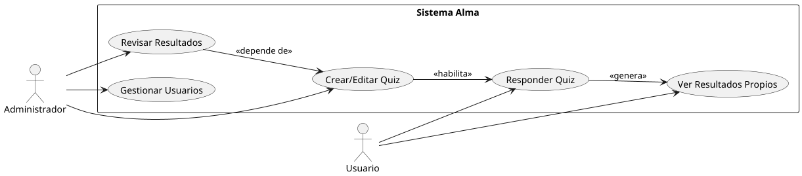
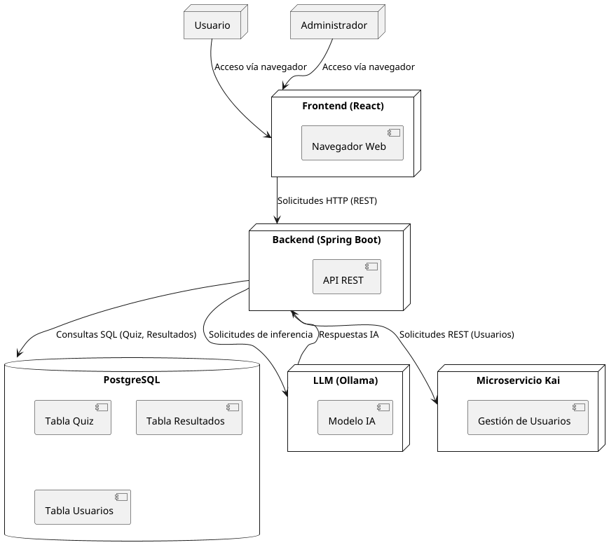

# Alma

**AI Learning & Measurement Assistant**

Alma es una plataforma completa para diseñar, responder y evaluar quizzes de forma flexible, incorporando inteligencia artificial para generar resultados y feedback personalizado. Es ideal para test de orientación, diagnósticos de conocimiento o selección de perfiles técnicos/gerenciales.

---

## 🧠 Características principales

- **Quizzes dinámicos**: se definen en JSON y pueden modificarse sin recompilar.
- **Evaluación por IA (LLM)**: utiliza modelos como Ollama local o servicios externos a través de LangChain4j.
- **Frontend en React**: interfaz para usuarios y administradores, moderna y responsiva.
- **Backend Spring Boot**: arquitectura hexagonal, REST API, PostgreSQL y servicios de inferencia.
- **Modularidad y escalabilidad**: separación clara entre dominios, puertos y adaptadores.
- **Roles diferenciados**: usuarios pueden resolver quizzes; administradores pueden crearlos, editarlos y revisarlos.

---

## 📁 Estructura del proyecto

```
├── backend/           # Backend Java Spring Boot
│   ├── src/main/java/org/shark/alma/
│   │   ├── adapter/           # Adaptadores de entrada/salida
│   │   ├── application/       # Lógica de aplicación
│   │   ├── config/            # Configuración
│   │   ├── domain/            # Entidades y lógica de dominio
│   │   ├── infrastructure/    # Infraestructura y persistencia
│   │   ├── llm/               # Integración con modelos IA
│   │   └── QuizApplication.java
│   ├── resources/             # Configuración y scripts SQL
│   └── pom.xml                # Dependencias Maven
├── ui/                # Frontend React
│   ├── src/
│   │   ├── components/        # Componentes reutilizables
│   │   ├── pages/             # Vistas principales
│   │   ├── adapters/          # Adaptadores de datos
│   │   ├── models/            # Modelos de datos
│   │   ├── context/           # Contextos globales
│   │   └── styles/            # Estilos CSS
│   ├── public/                # Recursos estáticos
│   └── package.json           # Dependencias Node
├── docker-compose.yml         # Orquestación de servicios
├── Dockerfile.backend         # Imagen backend
├── Dockerfile.frontend        # Imagen frontend
├── Makefile                   # Comandos útiles
└── README.md                  # Documentación principal
```

---

## 🚀 Guía rápida de inicio

1. Clona el repositorio y accede a la carpeta raíz.
2. Inicia los servicios con Docker Compose:
   ```bash
   docker-compose up --build
   ```
3. Accede al frontend en `http://localhost:3000` y al backend en `http://localhost:8080`.

---

## 🛠️ Principales dependencias

- **Backend:** Spring Boot, PostgreSQL, LangChain4j, Ollama
- **Frontend:** React, Vite, Zustand, TailwindCSS

---

## 📌 Estado actual

- Backend funcional con endpoints REST y conexión a PostgreSQL.
- Frontend funcional con autenticación, panel de quizzes y resultados.
- Integración básica con modelos IA (Ollama local).
- Modularidad y separación de dominios implementada.
- Listo para pruebas y ampliación de funcionalidades.

---

## 📊 Diagramas UML


- **Diagrama de componentes:**
  
  - Muestra la arquitectura general del sistema, incluyendo los módulos principales de backend, frontend y las integraciones externas.
- **Diagrama de casos de uso:**
  
  - Representa los actores (usuario, administrador) y sus interacciones con los casos de uso principales: gestión de quizzes, resultados y usuarios.
- **Diagrama de despliegue:**
  
  - Ilustra cómo se distribuyen los componentes en la infraestructura: frontend, backend, base de datos, microservicio Kai y la instancia de LLM (Ollama).

Para visualizar los diagramas, abre los archivos PNG en la carpeta `docs/` o consulta las imágenes embebidas arriba.

---

## 📄 Licencia

Este proyecto está bajo la licencia MIT.
